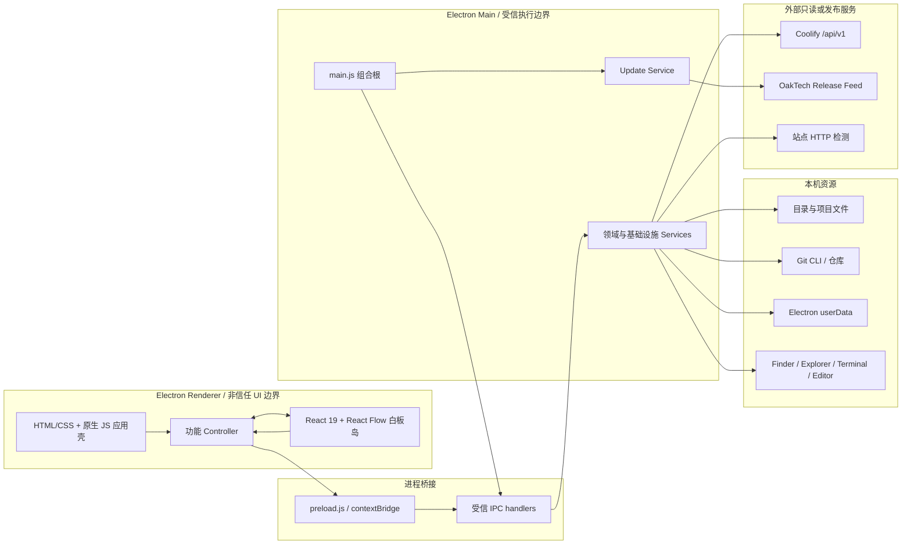
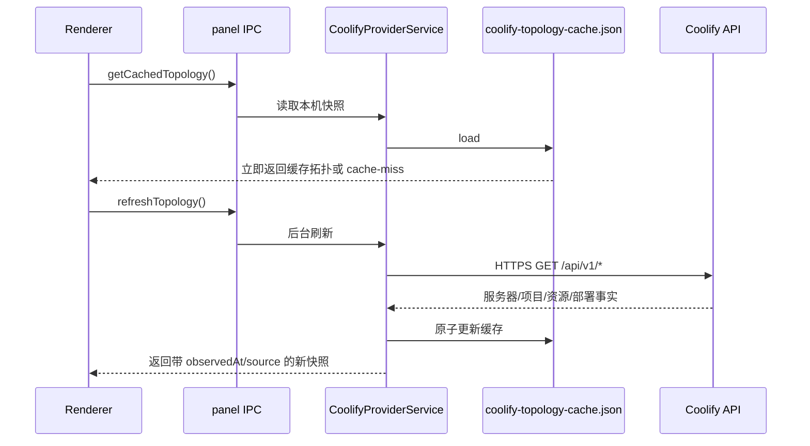
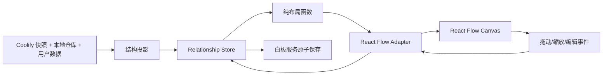
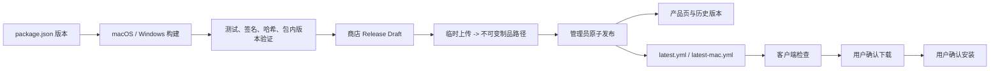
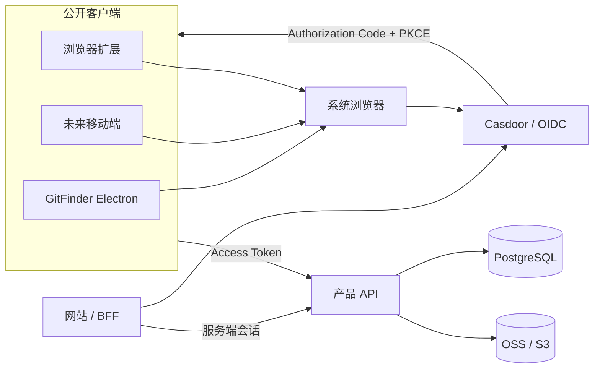

# GitFinder 2 系统架构与技术栈

> 文档状态：2026-09-04，根据当前仓库代码、`package.json` 和已接受 ADR 整理。
> 本文明确区分“当前已实现”和“规划中”，不把设计备忘或未来方案描述为已经交付。

## 1. 文档目的

本文面向 GitHub 访客、开发者、维护者和后续接手项目的 AI，回答以下问题：

- GitFinder 2 解决什么问题，哪些能力属于产品边界；
- Electron 主进程、渲染进程、IPC、领域模型和外部服务如何协作；
- 目录、Git、项目、部署关系、关系白板和在线更新的数据从哪里来、保存到哪里；
- 当前使用了哪些技术栈，哪些技术只是后续计划；
- 新功能应该放在哪一层，哪些边界不能绕过；
- 当前架构债务是什么，下一阶段如何演进。

需要了解业务术语时先阅读 [CONTEXT.md](./CONTEXT.md)，需要了解某项决定的原因时阅读 [docs/adr](./docs/adr)。

## 2. 产品定位与架构原则

GitFinder 2 是一个**本地优先、可离线运行的开发与部署关系管理工具**。它把以下对象放到同一工作区：

- 本地目录与项目；
- 一个项目下的一个或多个 Git 仓库；
- Git 工作区、分支、远程和提交事实；
- Coolify 服务器、Project、部署资源和访问点；
- 用户维护的白板布局、备注、归档和显式关系；
- 软件版本检查、下载与安装入口。

核心原则：

1. **本地优先**：登录、云端数据库或网络连接不能成为目录、Git 和白板的启动前置条件。
2. **事实来源明确**：本地文件系统、Git、Coolify、用户关系和 HTTP 检测是不同来源，不能互相伪装。
3. **只读接入部署平台**：当前 Coolify 集成读取状态，不提供停止、重启、删除、部署或环境变量写入。
4. **最小权限边界**：渲染进程没有 Node.js 权限，文件系统、Git、网络凭据和系统操作只能通过受信 IPC 到达主进程。
5. **关系、布局、外观分离**：节点归属是领域结构，坐标是布局结果，颜色、形状和卡片样式是显示配置。
6. **用户控制更新**：检查、下载和安装是三个独立动作；用户可关闭启动检查，下载和安装必须由用户确认。
7. **兼容演进**：React Flow 只替换通用画布能力，持久化格式不能写入 React Flow 内部对象。

## 3. 当前运行时架构



### 3.1 Electron 主进程

`main.js` 是应用组合根，负责：

- 单实例锁、窗口生命周期、菜单和平台差异；
- 注册 IPC 模块并注入主进程服务；
- 创建在线更新服务并把状态事件发送给渲染进程；
- 拒绝主窗口内部导航和未经允许的新窗口；
- 记录本地启动/崩溃信息，当前不上传崩溃报告。

业务逻辑不应继续堆入 `main.js`。新能力应优先形成 `src/main/services/*Service.js`，再由 `src/main/ipc/*.js` 暴露最小接口。

### 3.2 Preload 与 IPC

`preload.js` 通过 `contextBridge` 暴露 `window.gitFinder`，是渲染进程可调用能力的唯一入口。IPC 按领域拆分：

| IPC 模块 | 主要职责 |
| --- | --- |
| `filesystem.js` | 目录读取、扫描、授权位置和系统打开 |
| `fileOperations.js` | 复制、移动、重命名、回收站、撤销/重做 |
| `content.js` | 文本预览、缩略图、搜索和索引 |
| `git.js` | Git 状态、分支、远程、提交和变更操作 |
| `localProjects.js` | 本地项目身份与项目内仓库发现 |
| `projectTasks.js` | 项目任务投影、Git 证据和受控回写 |
| `panel.js` | 直接 Coolify 连接、缓存拓扑和部署关联；`panel:*` 是兼容命名 |
| `relationshipBoards.js` | 关系白板读取、保存、导入和导出 |
| `config.js` | 本机偏好、分组、标签、仓库注册表 |
| `terminal.js` | 外部终端和编辑器能力 |

所有 IPC handler 应通过 `src/main/ipc/security.js` 验证调用页面，只接受应用自己的 `file://.../src/renderer/index.html`。

### 3.3 渲染进程

当前渲染层不是完整 React 应用，而是混合架构：

- `src/renderer/index.html`：应用页面、面板和脚本装配；
- `src/renderer/scripts/app.js`：应用壳、共享状态和兼容编排入口；
- `src/renderer/scripts/appControllerRegistry.js`：集中创建功能 Controller，并维持旧公开方法的兼容委托；
- `src/renderer/scripts/*Controller.js`：目录、文件操作、Git、项目、设置和白板等功能控制器；
- `src/renderer/relationship-canvas/index.jsx`：关系白板的 React Flow 渲染与交互区域；
- `src/renderer/styles/*.css`：应用级样式和仍在迁移中的旧白板样式。

React 的使用范围目前只限关系白板。除非有独立 ADR 和迁移门禁，不应把“已经使用 React Flow”误解为“整个应用已经迁移到 React”。

### 3.4 Shared 纯模型与适配层

`src/shared` 放置不依赖 Electron UI 的模型、投影和纯函数，可由 Node 测试直接验证：

| 模块 | 责任 |
| --- | --- |
| `relationshipGraphModel.js` | 白板 schema、默认值、迁移、规范化和验证 |
| `panelTopologyProjection.js` | Coolify 拓扑到 GitFinder 领域实体/关系的投影 |
| `relationshipProjectStructure.js` | Project 容器与访问点归属规则 |
| `relationshipLayoutPrimitives.js` | 无状态几何与排列基础函数 |
| `relationshipProjectGalaxyLayout.js` | Project 分组布局算法 |
| `relationshipProjectSnap.js` | Project 内部署卡片吸附和对齐 |
| `relationshipPortRouter.js` | 连线端口选择 |
| `relationshipFlowRouting.js` | React Flow 边路由 |
| `relationshipFlowAdapter.js` | 领域模型与 React Flow nodes/edges 的双向适配 |
| `repositoryAssociation.js` | 本地仓库与远端部署的稳定关联规则 |

这些模块的关键约束是：**投影产生结构，布局只改变坐标，适配器只转换表示，渲染器不成为事实源。**

## 4. 核心领域模型

### 4.1 项目与 Git 仓库

- 本地项目由稳定 `projectId` 标识，是目录和若干 Git 仓库的聚合容器。
- Git 仓库是项目或普通目录上的能力属性，一个项目可以包含零个、一个或多个仓库。
- 仓库身份不能只依赖可变的绝对路径；本机仓库注册表维护稳定 ID 与路径映射。
- 目录移动、仓库归档和再次发现时，尽量保持已有分组、标签和部署关联。

### 4.2 部署拓扑

关系白板中的主要领域层级是：

```text
服务器 -> Project -> 部署资源 -> 访问点
                         \
                          -> 本地 Git 仓库关联（相关性，不是层级）
```

- Coolify 是服务器、Project、部署状态和域名事实的权威来源。
- GitFinder 是本地项目身份、目录、仓库事实、显式部署关联和白板排版的权威来源。
- “最近部署失败”“当前运行状态”“HTTP 可访问性”是不同维度，缺少证据时显示未知。
- 独占访问点可按设置进入 Project 容器；被多个来源共享的访问点保持唯一外部节点，并可产生诊断警告。

### 4.3 关系白板

白板持久化模型包含：

- `entities`：服务器、Project/group、部署、访问点、仓库和普通白板元素；
- `relationships`：带类型、方向、标签、来源和诊断信息的关系；
- `boards`：视图设置、placements、viewport、归档和用户显示偏好；
- `activeBoardId`：当前白板。

React Flow 的 `node`、`edge`、`parentId`、测量尺寸和临时交互状态只存在于渲染适配层，不写入白板文件。

## 5. 关键数据流

### 5.1 启动与 Coolify 缓存刷新



因此应用启动不依赖每次成功连接 Coolify。缓存提高可用性，但必须标明其时间和 `cached` 状态，不能把旧快照显示成实时事实。

### 5.2 白板投影、渲染与保存



后台拓扑刷新可以更新动态事实，但不能无条件覆盖用户坐标、别名、备注、归档、锁定、容器尺寸和手工关系。

### 5.3 文件操作

文件变更采用“预览/确认 -> 执行 -> 记录 -> 可恢复”的思路：

1. 渲染进程提交路径和操作意图；
2. 主进程验证路径位于受管目录内，并拒绝受保护目标；
3. Service 生成操作计划、冲突策略或事务日志；
4. 执行文件系统操作并记录历史；
5. 支持的操作可撤销/重做，进程异常时从事务日志恢复。

渲染进程不得通过任意 shell 字符串绕过此流程。

## 6. 数据持久化

### 6.1 当前本机存储

当前实现使用 JSON 和项目文件，不使用 SQLite。主要数据位于 Electron `userData`；无法取得该目录时回退到 `~/.gitfinder`。

| 文件/位置 | 内容 | 是否可同步/导出 |
| --- | --- | --- |
| `config.json` | UI 偏好、工作区标签、更新开关等本机设置 | 未来可选择性同步，需字段白名单 |
| `groups.json` / `tags.json` | 仓库分组和标签 | 可迁移，但不应携带无效绝对路径 |
| `repos.json` / `repoRegistry.json` | 当前扫描结果和稳定仓库身份 | 本机事实，不宜直接跨设备覆盖 |
| `relationship-boards.json` | 默认关系白板数据 | 可导出，云同步需冲突模型 |
| `whiteboard-library.json` | 白板文档索引 | 本机索引，文件本体另行管理 |
| `coolify-session.json` | Coolify 地址、标签和只读 Token | 敏感，仅本机；禁止进入导出与云同步 |
| `coolify-topology-cache.json` | 最近一次部署拓扑快照 | 可重建缓存，不作为跨设备事实源 |
| `coolify-repository-associations.json` | 部署与本地仓库关联 | 需要设备/仓库身份迁移规则 |

项目目录内的便携数据：

| 路径 | 内容 |
| --- | --- |
| `.gitfinder/project.json` | 项目身份、名称和仓库排除规则 |
| `.gitfinder/deployments.json` | 稳定 Provider/资源 ID 与本地仓库关联，不含 Token |
| `*.gitfinder-board/board.json` | 可携带白板正文 |
| `*.gitfinder-board/assets/` | 白板附件资源 |
| `.gfb` | 经过路径和大小校验的 ZIP 白板交换包 |

### 6.2 规划中的云端数据分层

云能力不会取代本地存储，而是增加可选同步层：

| 数据类型 | 推荐存储 | 状态 |
| --- | --- | --- |
| 本地目录、Git 状态、运行缓存 | 本机文件/未来可评估 SQLite | 当前本地实现 |
| 用户、团队、协作元数据、同步索引 | PostgreSQL；近期可继续托管 Supabase PostgreSQL | 规划中 |
| 登录身份 | Casdoor + OIDC/OAuth 2.0 | 已决策，未接入 GitFinder |
| 安装包、白板附件、用户大文件 | OSS 或兼容 S3 的对象存储 | 发布侧部分使用，用户云空间未实现 |

详细边界见 [docs/data-platform-strategy.md](./docs/data-platform-strategy.md)。

## 7. 在线更新与软件发布

GitFinder 客户端与软件商店不做双向互写。发布记录是一次事务，不同阶段有各自唯一事实源：



关键约束：

- 构建版本来自 `package.json`，锁文件和包内版本必须一致；
- 安装包先上传到临时位置，由服务端重新计算大小和 SHA-512；
- 产物提升到带版本号的不可变路径后，最后才切换 `latest*.yml`；
- 任一步失败都继续保留上一条 Published Release；
- 客户端只读取稳定 HTTPS manifest，不解析商店网页，也不访问后台 API；
- 用户可关闭启动检查；手动检查始终可用；检查不自动下载；
- 正式稳定版必须有 macOS/Windows 签名，并在已安装旧版上完成真实升级验证。

协议详见 [docs/release-control-plane.md](./docs/release-control-plane.md) 和 [docs/online-update-publishing.md](./docs/online-update-publishing.md)。

## 8. 安全边界

### 8.1 桌面应用

- `nodeIntegration: false`、`contextIsolation: true`、`sandbox: true`；
- preload 只暴露明确的方法，不把 `ipcRenderer` 或 Node API 整体交给页面；
- IPC 校验 sender URL，并在主进程再次验证路径、参数、大小和状态；
- 主窗口阻止任意导航与新窗口；外部地址通过主进程白名单化能力打开；
- 目录访问受“受管根目录”约束，真实路径检查阻止符号链接越界；
- 文件写入、配置和白板保存使用临时文件/原子替换或事务日志；
- 白板导入限制文件数量、单文件大小、总大小和路径形式，阻止 ZIP path traversal；
- Token、Cookie、私钥、授权头和可恢复凭据禁止进入项目文件、白板、日志与导出包。

### 8.2 外部服务

- Coolify Token 只允许 `read`，不要求 `read:sensitive`、`write`、`deploy` 或 `root`；
- 在线更新默认只允许 HTTPS，开发诊断的 localhost HTTP 需要显式双开关；
- `electron-updater` 使用 manifest 中的 SHA-512 校验下载内容，但哈希不替代代码签名；
- 未来 Casdoor 登录中，Electron、移动端和浏览器扩展均按公开客户端处理，使用系统浏览器和 Authorization Code + PKCE，不内置客户端密钥；
- 业务角色、套餐、许可证、团队和配额保存在产品数据库，不把认证平台当业务数据库。

## 9. 统一认证与协作架构（规划中）

统一的是认证技术栈，不强制所有产品共享同一用户账户。



- 每个需要独立账号体系的产品使用独立 Casdoor Organization 和 Application；
- 只有明确需要跨产品 SSO 时才共享用户域或建立用户确认的账号关联；
- GitFinder 未登录时保持完整离线能力；登录只开启云备份、配置同步和未来协作；
- 本机修改先进入本地事实源，再由同步引擎上传；云端不可直接覆盖本机路径和设备专属凭据；
- 同步对象需要稳定 ID、schema version、revision、更新时间、设备 ID、删除墓碑和冲突策略。

完整决策见 [ADR-0011](./docs/adr/0011-shared-authentication-stack-with-optional-account-sharing.md)。

## 10. 技术栈

版本号以当前 [package.json](./package.json) 为准，本文不复制容易过期的依赖小版本。

| 层级 | 技术 | 当前用途 | 状态 |
| --- | --- | --- | --- |
| 桌面运行时 | Electron | macOS/Windows 桌面窗口、系统菜单、IPC、系统集成 | 已使用 |
| 主进程运行时 | Node.js / CommonJS | 文件系统、Git 子进程、服务与 IPC | 已使用 |
| 页面基础 | HTML5、CSS、原生 JavaScript | 应用壳、目录、侧栏、设置和多数控制器 | 已使用 |
| UI 组件 | React、React DOM | 关系白板独立渲染区域 | 已使用，范围受限 |
| 图编辑引擎 | `@xyflow/react`（React Flow） | 节点、边、选择、拖动、容器、缩放和小地图 | 已使用 |
| 前端构建 | esbuild | 将 JSX 白板入口打包为浏览器 IIFE | 已使用 |
| 本地 Web/夹具 | Express | 开发预览、浏览器夹具和部分本地接口 | 已使用，不是生产云后端 |
| Git | 系统 Git CLI | 状态、diff、分支、远程和受控写操作 | 已使用 |
| 本机持久化 | JSON + 原子文件写入 | 偏好、仓库身份、白板、缓存和会话 | 已使用 |
| 项目便携格式 | JSON、目录包、ZIP `.gfb` | 项目身份、部署关联、白板与附件交换 | 已使用 |
| ZIP | `yauzl`、`yazl`、`buffer-crc32` | 安全读取和生成白板包 | 已使用 |
| 在线更新 | `electron-updater` | 版本检查、下载、安装事件与校验 | 已使用 |
| 桌面打包 | `electron-builder`、`@electron/packager` | DMG/ZIP、NSIS/ZIP 和构建辅助 | 已使用 |
| 测试 | Node.js `node:test` + 项目回归夹具 | 单元、契约、UI 静态契约和语法检查 | 已使用 |
| 部署 Provider | Coolify REST API `/api/v1` | 只读服务器、项目、资源和部署历史 | 已使用 |
| 统一认证 | Casdoor + OIDC/OAuth 2.0 + PKCE | 网站、桌面、扩展和移动端的统一登录技术栈 | 已决策，未接入 |
| 云端关系数据 | PostgreSQL / 托管 Supabase PostgreSQL | 用户空间、协作和同步元数据 | 规划中 |
| 大文件与安装包 | 阿里云 OSS 或兼容 S3 对象存储 | 不可变安装包、附件和未来用户文件 | 发布侧演进中 |

## 11. 仓库目录与模块地图

```text
gitfinder-2/
├── main.js                         # Electron 组合根与窗口生命周期
├── preload.js                      # 最小化 renderer -> main API
├── server.js                       # 本地 Web 开发/夹具入口
├── cli.js                          # 命令行入口
├── src/
│   ├── main/
│   │   ├── ipc/                    # 参数校验、权限边界、服务调用
│   │   └── services/               # 文件、Git、项目、Coolify、白板、更新
│   ├── renderer/
│   │   ├── index.html              # 应用页面和脚本装配
│   │   ├── scripts/                # 应用壳与按功能拆分的 Controller/View
│   │   ├── relationship-canvas/    # React Flow 白板岛
│   │   ├── generated/              # esbuild 生成物，不手工编辑
│   │   └── styles/                 # 应用与兼容样式
│   └── shared/                     # 纯模型、投影、路由、布局和适配器
├── scripts/                        # 构建、发布、夹具和度量脚本
├── test/                           # Node 测试、契约测试和语法门禁
├── docs/
│   ├── adr/                        # 不易回头的架构决策
│   ├── product/                    # 产品方案；不等于已交付
│   ├── verification/               # 指定版本/阶段的验证记录
│   └── ai-handoff/                 # AI 接续所需的项目知识与历史
└── resources/                      # 打包期静态配置，例如更新源
```

## 12. 新功能的放置规则

新增一个功能时按以下顺序判断：

1. **是否是纯领域规则？** 放入 `src/shared`，输入输出使用普通对象并直接测试。
2. **是否需要文件、Git、网络凭据或操作系统能力？** 放入 `src/main/services`。
3. **是否需要给页面提供能力？** 添加小而明确的 IPC handler，再由 preload 暴露语义方法。
4. **是否只是 UI 状态和交互编排？** 放入独立 Renderer Controller/View。
5. **是否是画布通用交互？** 优先使用 React Flow 能力，不在旧控制器中重新实现拖动、框选、端口或缩放。
6. **是否改变持久化、权限、身份或发布协议？** 先写/更新 ADR 和迁移测试。

禁止的捷径：

- 从 renderer 直接 `require('fs')`、执行 Git 或访问 Token；
- 把 React Flow nodes/edges 直接保存为白板文件；
- 用布局函数修改 `groupId` 或来源关系；
- 用 CSS 隐藏结构错误，或用结构投影修复纯视觉问题；
- 在客户端内置数据库 service key、OIDC client secret 或发布密钥；
- 只修改网页展示版本，不经过发布事务切换更新 manifest。

## 13. 构建、测试与发布门禁

常用命令：

```bash
npm run build:renderer       # 构建 React Flow 白板岛
npm test                     # Node 测试
npm run check                # renderer 构建 + 全量测试 + JS 语法检查
npm run measure:whiteboard   # 关系白板一方代码量度量
npm run electron             # 启动本地 Electron 开发版
npm run pack                 # macOS 构建入口
npm run pack:win             # Windows 构建入口
```

验证需要分层：

- 纯模型测试证明规则和迁移；
- 浏览器夹具证明隔离 UI 行为；
- Electron 开发版证明 IPC 与本机能力；
- 打包安装版证明真实启动、权限、存储和升级；
- Windows 必须在真实 Windows x64 环境验收，macOS 交叉产物不能替代；
- 发布必须在已安装旧版上完成发现、取消、下载失败、下载校验、安装和数据保留测试。

## 14. 当前架构债务与演进路线

### 14.1 已知架构债务

- 关系白板虽然已经接入 React Flow，但旧 `relationshipBoardController.js` 和 `relationships.css` 仍承担大量渲染、交互和兼容逻辑；
- `npm run measure:whiteboard` 当前口径为 13,554 行，距离 ADR-0009 的不超过 4,848 行目标仍差 8,706 行；
- `app.js`、`configService.js`、`fileOperationService.js` 和部分投影模块仍偏大，应按真实职责和测试切片继续拆分，而不是只移动代码；
- `panel:*` IPC 名称是从旧 Panel 方案保留的兼容层，实际运行已经直接读取 Coolify；
- Renderer 仍存在全局脚本兼容入口，模块依赖主要依靠加载顺序和 registry；
- Casdoor 登录、云备份、配置同步和多人协作尚未实现；
- Linux target 虽在打包配置中声明，但当前主要验收目标仍是 macOS 与 Windows。

### 14.2 推荐演进顺序

1. 删除已经由 React Flow 负责的旧 DOM 渲染、手势、路由和样式实现；
2. 把白板控制器缩为命令编排、历史记录、保存和 React 事件桥接；
3. 继续把拓扑诊断、过滤、卡片呈现模型提炼成可测 shared 模块；
4. 收敛 preload API，并将 `panel:*` 迁移到中性 `deployments:*` 命名；
5. 为本机配置定义可同步字段 schema，再决定 JSON 是否需要迁移到 SQLite；
6. 先接入 Casdoor 登录最小切片，再实现配置备份，最后实现实时协作；
7. 将商店发布草稿、制品和 manifest 切换完成为可审计的原子发布事务。

## 15. 架构文档与可视化维护方式

本文使用 Mermaid，原因是 GitHub 可以直接展示、源码可审查、变更可随提交对比。对于更复杂的交互式架构图，可以参考 [Archify](https://github.com/tt-a1i/archify) 的方法，但应遵守以下约束：

- 架构节点必须能回到当前仓库中的源码文件或 ADR 证据；
- “上游/下游”“调用路径”和“数据流”必须来自真实依赖，不由图形布局猜测；
- 图形是架构的视图，不是新的事实源；正式事实仍是代码、schema、测试和 ADR；
- 生成物可提供 HTML/SVG/PNG，但可审查的结构化源文件必须一起保存；
- 架构改造可保存 Before/After 快照，明确新增、删除、移动和改道的模块；
- Archify 若被采用，应作为文档工具或 CI 辅助，不进入 GitFinder 桌面应用运行时依赖。

后续若建设交互式仓库结构图，建议新增：

```text
docs/architecture/
├── runtime.json             # 可审查的架构节点和边
├── release-workflow.json    # 发布工作流
├── cloud-sync-sequence.json # 登录与同步时序
└── generated/               # HTML/SVG/PNG 派生物
```

## 16. ADR 索引

| ADR | 主题 | 当前作用 |
| --- | --- | --- |
| [0001](./docs/adr/0001-independent-architecture.md) | GitFinder 2 独立演进 | 保留 2.0 项目边界；Panel 运行依赖部分已被 0004 取代 |
| [0002](./docs/adr/0002-panel-topology-and-repository-identity.md) | 拓扑与仓库身份 | 保留稳定身份和投影原则；Provider 路径以 0004 为准 |
| [0003](./docs/adr/0003-app-owned-panel-session.md) | 应用自有会话 | 定义本机凭据边界；Provider 以 Coolify 为准 |
| [0004](./docs/adr/0004-direct-coolify-provider.md) | 直接连接 Coolify | 当前部署数据源决定 |
| [0005](./docs/adr/0005-whiteboard-project-folders.md) | 白板项目目录 | 可携带白板与资源 |
| [0006](./docs/adr/0006-whiteboard-zip-packages.md) | `.gfb` ZIP 包 | 跨平台交换格式和安全约束 |
| [0007](./docs/adr/0007-independent-board-structure-and-layout.md) | 结构与布局分离 | 当前白板核心不变量 |
| [0008](./docs/adr/0008-relationship-whiteboard-module-boundaries.md) | 白板模块边界 | 领域边界继续有效，构建约束由 0009 更新 |
| [0009](./docs/adr/0009-react-flow-whiteboard-engine.md) | React Flow 引擎 | 当前白板迁移方向和代码量门禁 |
| [0010](./docs/adr/0010-user-controlled-online-updates.md) | 用户控制在线更新 | 当前更新交互与隐私边界 |
| [0011](./docs/adr/0011-shared-authentication-stack-with-optional-account-sharing.md) | 统一认证技术栈 | Casdoor/OIDC 规划和账号隔离策略 |

## 17. 文档更新规则

以下变更必须同步更新本文：

- 新增或删除主要进程、外部服务、持久化格式；
- 改变 Electron 安全选项、IPC 信任边界或凭据保存方式；
- 改变关系白板 canonical schema 或 React Flow 适配边界；
- 接入 Casdoor、云同步、PostgreSQL/SQLite 或对象存储；
- 改变软件商店发布事务或客户端更新协议；
- 新 ADR 取代本文中的现行决定。

时间敏感的版本号、测试总数、线上发布版本和已安装 App 验收结果不写死在本文；这些信息分别以 `package.json`、测试输出、商店 Published Release 和 `docs/verification` 为准。
